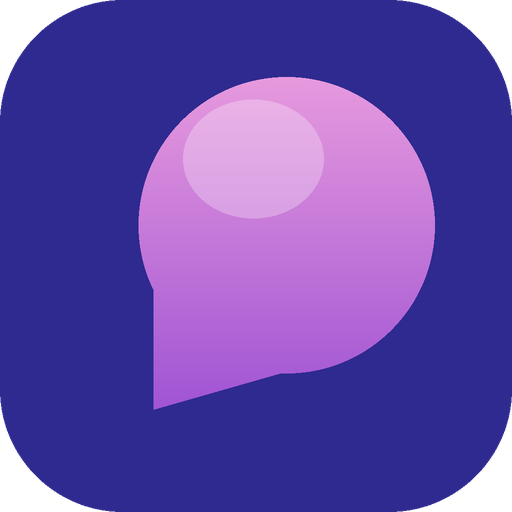

<p align="center">
  
</p>

# Memento

**Your Mac remembers. You don't have to.**

Memento quietly notices what you're working on and finds the loops you left
open: the replies you owe, the follow-ups you promised, the things you said
you'd do. Then it closes them out as you get to them. Automatically, in the
background.

No subscription. Nothing leaves your Mac. It runs on the AI you already pay for.

## Get started

One command:

```bash
brew install memento && memento
```

That's it. A small **Memento icon** appears in your menu bar (top right, next to Wi-Fi).

## Everything lives in the icon

Click it to:

- **See your open loops**, the things still on your plate
- **Close one** with a click
- **Review now** to catch new loops on demand
- **Pause** capture whenever you want
- **Settings** to pick your AI (Claude, Codex, or paste an API key) right there
- **Connect to Claude** in one click

No config files. No terminal. No dashboards to check.

## Why people use it

- **It finds what you'd forget.** A promise buried in a Slack thread on Monday
  doesn't vanish by Friday.
- **It closes the loop itself.** When you actually reply, Memento notices and
  checks it off. You don't manage a to-do list, it manages itself.
- **It's already paid for.** It uses your Claude Code or Codex, so there's no new bill.
- **It's yours.** Your memory is a local file on your own Mac. Password managers
  and banking are ignored by default.

## Private by design

Everything is captured and stored on your machine. Nothing is sent anywhere
unless you opt in to a cloud model, and even then only what that request needs.
Pause anytime from the menu bar, and wipe everything by quitting and deleting one
folder.

Built for people who live in Slack, Mail, Notion, browsers, and a dozen other
tabs, and are tired of things slipping through the cracks.

Developer? Setup, architecture, and how to add apps live in
[CONTRIBUTING.md](CONTRIBUTING.md).
